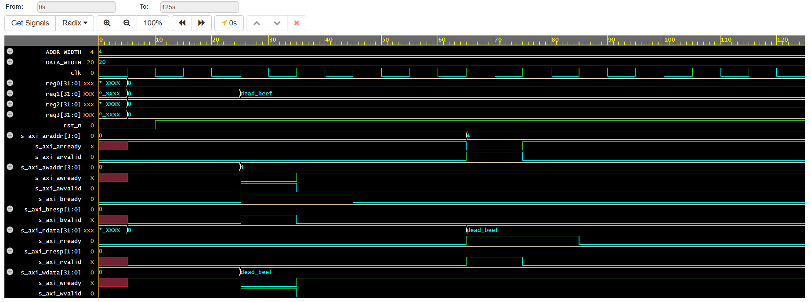

# AMBA AXI4-Lite Compliant Memory-Mapped Slave IP Core

## 📌 Project Overview
This repository contains a fully synthesizable, production-grade memory-mapped register file IP core implemented in SystemVerilog. The architecture adheres strictly to the AMBA AXI4-Lite bus interface specification, managing dual independent channels for simultaneous read/write control operations. This IP block serves as a fundamental building block for System-on-Chip (SoC) peripheral integration and processor-to-accelerator communication interlinks.

## ⚡ Technical Architecture
The core architecture safely decouples data control paths through structural state evaluation and handshake monitoring across the standard five AXI4-Lite signaling channels:

* **Write Infrastructure:** * `AW (Write Address)` & `W (Write Data)`: Dual-channel validation logic.
  * `B (Write Response)`: Dedicated handshake confirmation returning an `OKAY` status ($2\text{'b00}$) to the bus master upon data commitment.
* **Read Infrastructure:**
  * `AR (Read Address)`: Active address line sampling and decoding.
  * `R (Read Data)`: Multiplexed high-speed readout path returning register data with an `OKAY` status packet.
* **Register Space Layout:** Implements 4 independent internal 32-bit memory-mapped registers (`reg0` to `reg3`) with automated local byte-address decoding.

## 📊 Verification Waveform Analysis
The IP block was validated using an automated SystemVerilog testbench mapping operational sequence handling:



1. **Write Cycle Execution (~30ns):** The Master drives Address `4` (`reg1`) with data `32'hDEADBEEF`. The core asserts `awready` and `wready` simultaneously, capturing the payload on the next clock edge.
2. **Read Verification Cycle (~70ns):** The Master issues a read request at Address `4`. The core performs address decoding, maps the location back to `reg1`, places `32'hDEADBEEF` onto the read bus line, and drives `s_axi_rvalid` high to finalize the data exchange.

## 🛠️ How to Replicate
1. Load the design files into any standard IEEE-compliant HDL simulator (e.g., Vivado, ModelSim, or [EDA Playground](https://www.edaplayground.com/)).
2. Compile `rtl/axi_lite_slave.sv` alongside the testbench wrapper `tb/tb_axi_lite.sv`.
3. Select **Icarus Verilog 12.0** or **Aldec Riviera-PRO** as the simulator target tool.
4. Run the simulation execution macro to view the transaction handshakes using any standard VCD waveform viewer (EPWave/GTKWave).

## 📂 Repository Structure
```text
├── rtl/                # Synthesizable SystemVerilog IP Core source files
├── tb/                 # Protocol-level verification testbenches
├── assets/             # Timing simulation waveforms and block diagrams
└── README.md           # Professional project documentation
